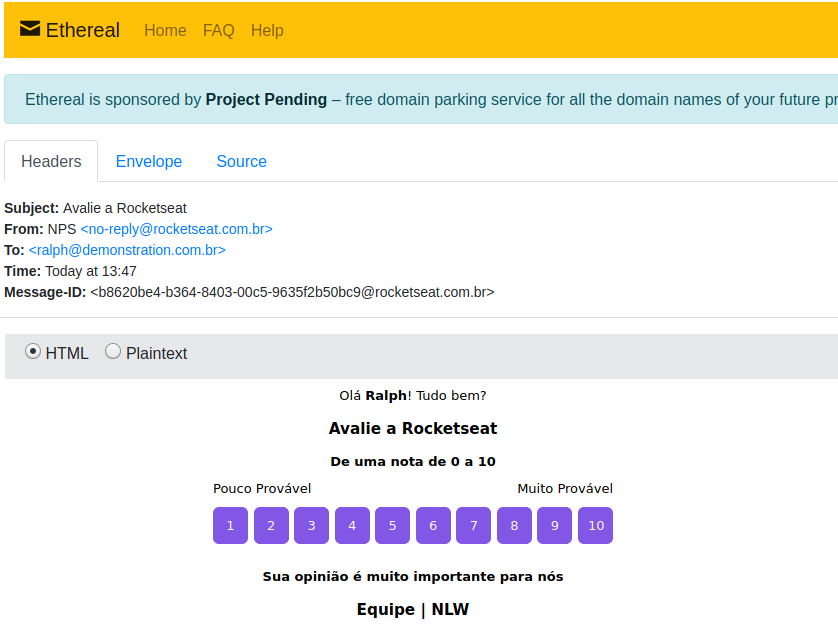

<h1 align="center">NPS-NLW</h1>

  <a href="#-Projeto">Projeto</a>&nbsp;&nbsp;&nbsp;|&nbsp;&nbsp;&nbsp;
  <a href="#-Tecnologias">Tecnologias</a>&nbsp;&nbsp;&nbsp;|&nbsp;&nbsp;&nbsp;
  <a href="#-Diagrama">Diagrama</a>&nbsp;&nbsp;&nbsp;|&nbsp;&nbsp;&nbsp;
  <a href="#-Como-executar">Como executar</a>

  

## 📙 Projeto

O NPS-NLW é uma aplicação que consiste em calcular o NPS da empresa. Nele fazemos o cadastro de usuários, cadastro de pesquisas, envio de e-mail para os usuários responderem as pesquisas de satisfação e com isso podemos realizar o cálculo do NPS.

Esse projeto foi desenvolvido durante a trilha de NodeJS, na quarta edição da NLW. Onde foi possível aprender conceitos sobre o que é um API, como iniciar um projeto utilizando Typescript e Express para gerenciamento das rotas, TypeORM para manipulação dos dados, testes automatizados e envio de e-mail.

## 💻 Tecnologias

Esse projeto foi desenvolvido com as seguintes tecnologias:

- [TypeScript](https://www.typescriptlang.org/)
- [Ethereal-Email](https://ethereal.email/)
- [TypeORM](https://typeorm.io/#/)
- [Express](https://expressjs.com/pt-br/)
- [Jest](https://jestjs.io/)
- [SQL Editor Beekeeper Studio](https://www.beekeeperstudio.io/)
- [Insomnia](https://insomnia.rest/)

## 📒 Diagrama

## 🔸 Como executar

- Clone o repositório
- Instale as dependências com `yarn`
- Inicie o servidor com `yarn dev`
- Utilize o Insomnia para realizar as requisições GET / POST

A aplicação pode ser acessada em [`localhost:3333`](http://localhost:3333).

---

:rocket: Desenvolvido durante a NLW4 - Trilha Nodejs 👋🏻 [Participe da nossa comunidade!](https://discordapp.com/invite/gCRAFhc)